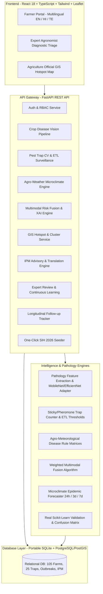

# AgriRaksha (అగ్రి రక్ష / कृषि रक्षा) — SIH 2026
## AI-Powered Crop Health Early Warning & Decision Support System

> **Smart India Hackathon (SIH) 2026 Prototype**  
> *"From reactive disease identification to proactive crop-health intelligence."*

[](https://www.python.org/)
[](https://fastapi.tiangolo.com/)
[](https://reactjs.org/)
[](https://www.typescriptlang.org/)
[](https://tailwindcss.com/)
[](https://leafletjs.com/)
[](LICENSE)

---

## 🌾 The Problem

In Indian agriculture, farmers typically recognize crop fungal diseases and pest infestations **only after visible foliar necrosis has spread irreversibly**. Field extension personnel cover expansive mandals with limited physical bandwidth, and certified laboratory diagnoses are often inaccessible in critical early windows.

Crucially, **weather microclimates, phenological crop stages, seed variety, soil condition, geospatial proximity, and local pest-trap dynamics** heavily govern crop-health risk, yet these variables have historically remained fragmented. Incorrect diagnosis leads to delayed treatment, inappropriate pesticide overuse, chemical residue contamination, increased cultivation costs, and devastating yield losses.

---

## 💡 The AgriRaksha Innovation

AgriRaksha is **NOT** a superficial "upload leaf $\rightarrow$ classify disease $\rightarrow$ spray pesticide" tool.

AgriRaksha is a **Multimodal Crop-Health Intelligence Platform**:

$$\text{Image} + \text{Weather Microclimate} + \text{Crop Stage} + \text{Location} + \text{Soil} + \text{Pest Traps} + \text{Outbreak History}$$
$$\Downarrow$$
$$\textbf{Detection} \longrightarrow \textbf{Risk Assessment} \longrightarrow \textbf{Forecast} \longrightarrow \textbf{Geo-Hotspots} \longrightarrow \textbf{Expert Validation} \longrightarrow \textbf{IPM Guidance} \longrightarrow \textbf{Follow-Up Tracking}$$

### Core Tenets:
1. **AI Safety & Transparent Uncertainty**: AI predictions are strictly probabilistic (`needs_expert_validation` flag). The platform never fabricates certainty.
2. **Explainable AI (XAI)**: Decomposes composite risk scores (0–100) into weighted contributing factors (visual evidence, humidity, phenological vulnerability, neighborhood outbreak radius, trap surges).
3. **Integrated Pest Management (IPM)**: Non-chemical first (cultural, mechanical, biological controls). Regulated chemical options strictly follow **CIB&RC** label claims with statutory disclaimers.
4. **Human-in-the-Loop Validation**: Triage review queue for agricultural scientists, feeding expert-confirmed field cases back into continuous learning training loops.
5. **Multilingual Inclusivity**: Real-time vernacular support in **English, हिंदी (Hindi), and తెలుగు (Telugu)**.

---

## 🏛️ System Architecture



---

## 🚀 Quick Start (Zero-Setup)

### 1. Prerequisites
- Python 3.8+
- Node.js v18+ & npm

### 2. Clone & Setup
```bash
git clone https://github.com/agriraksha/agriraksha.git
cd agriraksha
```

### 3. Launch with One Click (Windows)
Double-click `scripts\run_all.bat` or run:
```bash
# Terminal 1: Backend
cd backend
python -m uvicorn app.main:app --port 8000 --reload

# Terminal 2: Frontend
cd frontend
npm run dev
```

- **Farmer / Expert / Official Web Portal**: `http://localhost:3000` (or `http://127.0.0.1:8000`)
- **Interactive Swagger REST API Docs**: `http://127.0.0.1:8000/docs`

---

## 🧪 One-Click SIH 2026 Demonstration Scenario

Click the **"Load Demo Dataset"** button on the navbar (or run `python scripts/run_demo_scenario.py`) to execute the end-to-end hackathon demonstration:

1. **Farmer Field Submission**:
   - Farmer Ramesh Reddy (Geesugonda Village, Warangal) submits a Tomato leaf showing concentric brown spots.
2. **Modular Computer Vision**:
   - Probable Condition: **Early Blight** (*Alternaria solani*)
   - Confidence: **87%**
   - Severity: **Moderate** (28.5% foliage damage)
   - Uncertainty: `needs_expert_validation = True`
3. **Agro-Weather Microclimate Engine**:
   - Temperature: 24.5°C, Humidity: 86.0%, Rainfall: 18.5 mm, Leaf wetness: 6.5 hours.
   - Weather Suitability: 82/100 (High fungal incubation risk).
4. **Pest Surveillance Network**:
   - Pheromone Trap `TRAP-102` catches 37 adult Fruit Flies (increasing trend, exceeds ETL of 20).
5. **Geospatial Neighborhood Outbreaks**:
   - 6 laboratory-confirmed Early Blight cases identified within 5 km of the farm.
6. **Multimodal Risk Fusion (XAI)**:
   - Composite Risk: **78 / 100 — HIGH RISK**
   - Transparent XAI factor attribution generated for the farmer.
7. **IPM Guidance**:
   - Cultural sanitation, staking, biological *Trichoderma viride* spray, and statutory CIB&RC regulated safety guidelines.
8. **Multilingual Advisories**:
   - Dynamic farmer-friendly advisories generated in English, Hindi, and Telugu.
9. **Expert Validation Queue**:
   - Senior KVK Pathologist reviews the case, confirms the diagnosis, dispatches Mandal Agricultural Officer (MAO) for field inspection, and approves sample for the **Continuous Learning ML dataset**.
10. **Official Hotspot Map & 7-Day Follow-Up**:
    - Confirmed outbreak triggers a 5.0 km containment buffer on the Leaflet GIS map.
    - Day 7 follow-up submission verifies 35% lesion area reduction and case resolution!

---

## 📂 Monorepo Structure

```
agriraksha/
├── backend/                  # FastAPI Application
│   ├── app/
│   │   ├── api/              # API Endpoints (auth, disease, pest, risk, gis, ipm, dashboard)
│   │   ├── core/             # Configuration, security, JWT tokens
│   │   ├── db/               # SQLAlchemy models (Farms, Traps, Cases, Reviews, Advisories)
│   │   ├── services/         # Business logic (Multimodal risk, GIS clustering, IPM, Seeder)
│   │   └── schemas/          # Pydantic v2 schemas
│   ├── tests/                # Automated pytest suite (14 test cases)
│   └── requirements.txt
├── frontend/                 # React 18 + TypeScript + Vite + Tailwind CSS
│   ├── src/
│   │   ├── components/       # Reusable components (Navbar, Cards, Gauges)
│   │   ├── pages/            # FarmerPortal, ExpertPortal, OfficialDashboard
│   │   ├── i18n/             # Translations (English, Hindi, Telugu)
│   │   ├── services/         # REST API clients
│   │   └── types/            # TypeScript interfaces
│   └── package.json
├── ml/                       # Machine Learning & Pathology Pipelines
│   ├── disease_detection/    # Foliage verification & transfer learning vision engine
│   ├── pest_detection/       # Smart trap computer vision & ETL population analyzer
│   ├── severity/             # Foliage necrosis & lesion coverage calculator
│   ├── risk_prediction/      # Agro-meteorological disease rule matrices
│   ├── forecasting/          # 24h, 3d, 7d microclimate epidemic forecaster
│   ├── training/             # Transfer learning training harness
│   ├── evaluation/           # Real scikit-learn metrics & confusion matrix
│   └── xai/                  # Explainable AI risk factor attribution generator
├── docs/                     # Full SIH 2026 Technical Documentation:
│   ├── SETUP.md              # Installation & execution guide
│   ├── ARCHITECTURE.md       # Architectural deep-dive & mathematical formulas
│   ├── API.md                # REST API catalog with request/response schemas
│   ├── MODEL.md              # Machine learning pipelines & validation metrics
│   ├── DATABASE.md           # Schema relational design & spatial indexing
│   ├── DEMO.md               # Step-by-step hackathon pitch script
│   └── TESTING.md            # Test coverage & verification instructions
└── scripts/                  # One-click execution & demonstration scripts
```

---

## 🛡️ AI Safety & Non-Fabrication Protocol

- **Statutory Pesticide Protection**: AgriRaksha never fabricates chemical brand names or dosages. All chemical guidance references the **Central Insecticides Board & Registration Committee (CIB&RC)** package of practices and mandates consultation with local agricultural authorities.
- **Probabilistic Transparency**: Every AI output is accompanied by confidence ratings, severity quantification, and explicit uncertainty disclaimers.
- **Ground-Truth Continuous Learning**: Only expert-confirmed cases with agronomist approval enter the ground-truth training corpus.

---

## 👥 SIH 2026 Team Credentials

* **Platform**: AgriRaksha
* **Category**: Smart Agriculture / Decision Support System
* **Ministry / Organization**: Ministry of Agriculture & Farmers Welfare / ICAR
* **Hackathon**: Smart India Hackathon (SIH) 2026
