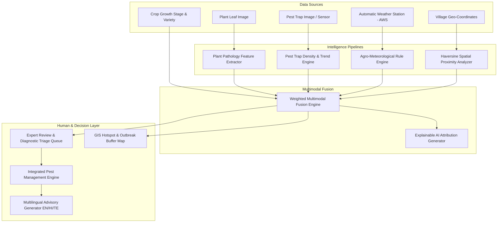

# System Architecture Specification — AgriRaksha (SIH 2026)

## 1. High-Level Architectural Paradigm

AgriRaksha transitions digital agriculture **from reactive image classification to proactive epidemiological intelligence**. Rather than treating plant pathology as an isolated computer-vision task, the platform constructs an interdependent decision matrix synthesizing visual symptoms, microclimate thermodynamics, phenological host susceptibility, neighborhood outbreak proximity, and insect vector surveillance.

---

## 2. Multimodal Risk Fusion Formulation

The platform computes the composite agricultural health risk score $R \in [0, 100]$ using a calibrated weighted linear combination:

$$R = \sum_{i=1}^{5} w_i S_i = w_{\text{vis}} S_{\text{vis}} + w_{\text{wx}} S_{\text{wx}} + w_{\text{crop}} S_{\text{crop}} + w_{\text{geo}} S_{\text{geo}} + w_{\text{pest}} S_{\text{pest}}$$

Where:
* $w_{\text{vis}} = 0.35$: Visual symptom evidence score derived from computer vision confidence and necrotic lesion area ($S_{\text{vis}} \in [0, 100]$).
* $w_{\text{wx}} = 0.25$: Microclimate suitability score based on relative humidity, leaf wetness duration, ambient temperature, and precipitation ($S_{\text{wx}} \in [0, 100]$).
* $w_{\text{crop}} = 0.15$: Phenological growth stage susceptibility multiplier ($S_{\text{crop}} \in [10, 100]$), where dense flowering/fruiting canopies experience higher humidity stagnation.
* $w_{\text{geo}} = 0.15$: Proximity score to active, laboratory-confirmed outbreak cases within a critical 5 km radius ($S_{\text{geo}} \in [0, 100]$).
* $w_{\text{pest}} = 0.10$: Local pest-trap vector pressure ratio relative to the Economic Threshold Level ($S_{\text{pest}} \in [0, 100]$).

### Risk Tier Boundaries
* **Low Risk**: $0 \le R \le 25$
* **Moderate Risk**: $26 \le R \le 50$
* **High Risk**: $51 \le R \le 80$
* **Very High / Epidemic Surge**: $81 \le R \le 100$

---

## 3. Agro-Meteorological Disease Rule Matrices

Fungal blights (such as *Alternaria solani* and *Phytophthora infestans*) require specific microclimate conditions for spore germination and mycelial penetration:

1. **Relative Humidity (RH)**:
   - $\text{RH} \ge 85\%$: $+35\text{ pts}$ (Prime hyphal development)
   - $75\% \le \text{RH} < 85\%$: $+25\text{ pts}$
   - $60\% \le \text{RH} < 75\%$: $+15\text{ pts}$
2. **Leaf Wetness Duration**:
   - $\ge 6.0\text{ hours}$: $+25\text{ pts}$ (Critical germination window)
   - $4.0 - 5.9\text{ hours}$: $+18\text{ pts}$
3. **Precipitation**:
   - $\ge 15.0\text{ mm}$: $+20\text{ pts}$ (Disperses soil-borne conidia to lower leaves)
4. **Thermal Growth Window**:
   - $20^\circ\text{C} \le T \le 30^\circ\text{C}$: $+15\text{ pts}$ (Optimum metabolic activity for Solanaceous pathogens)

---

## 4. Geospatial Proximity & Clustering Engine

Spatial proximity is calculated using the spherical Haversine distance formula:

$$d = 2 R_{\text{earth}} \arcsin\left(\sqrt{\sin^2\left(\frac{\Delta \phi}{2}\right) + \cos(\phi_1)\cos(\phi_2)\sin^2\left(\frac{\Delta \lambda}{2}\right)}\right)$$

Where $\phi$ denotes latitude, $\lambda$ denotes longitude, and $R_{\text{earth}} = 6371.0\text{ km}$.
* Confirmed cases within $5\text{ km}$ trigger localized alerts to surrounding farmers.
* The GIS engine aggregates cluster statistics by mandal and village, generating standard **GeoJSON FeatureCollections** rendered in real time on the Leaflet official dashboard.

---

## 5. Human-in-the-Loop & Continuous Learning Loop

1. **Triage Filter**: AI diagnoses with confidence $< 0.75$ or high severity are automatically routed to the Agronomist Review Queue.
2. **Ground-Truth Labeling**: When the pathologist confirms or modifies the diagnosis, the record is flagged as `approved_for_training_dataset = True`.
3. **Continuous Retraining**: Expert-confirmed specimens feed into the active dataset partition, perpetually refining model accuracy on regional Indian crop variants.
